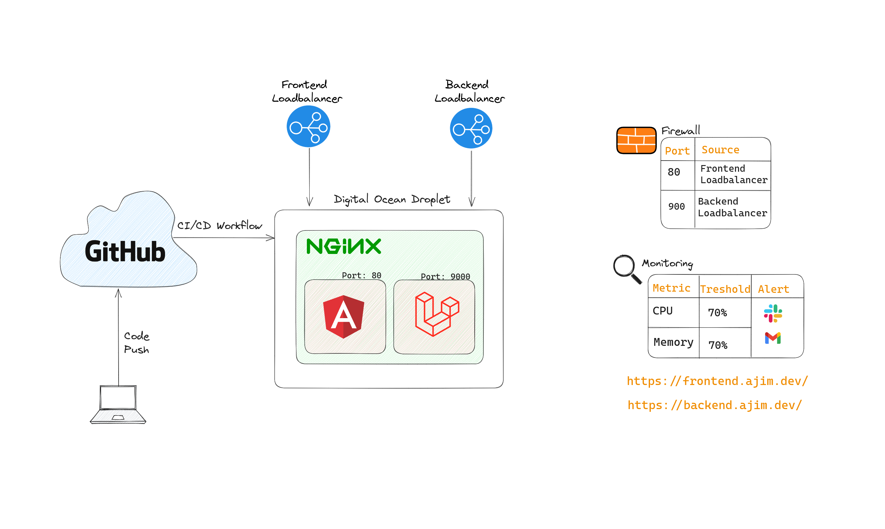
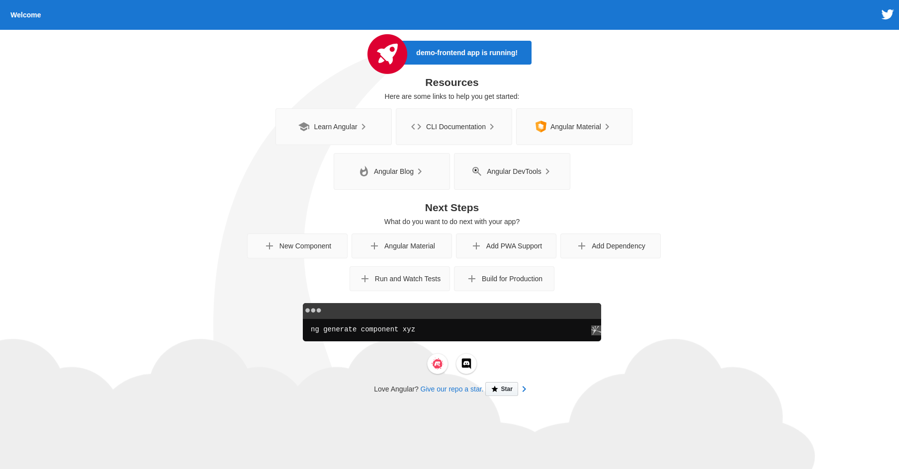
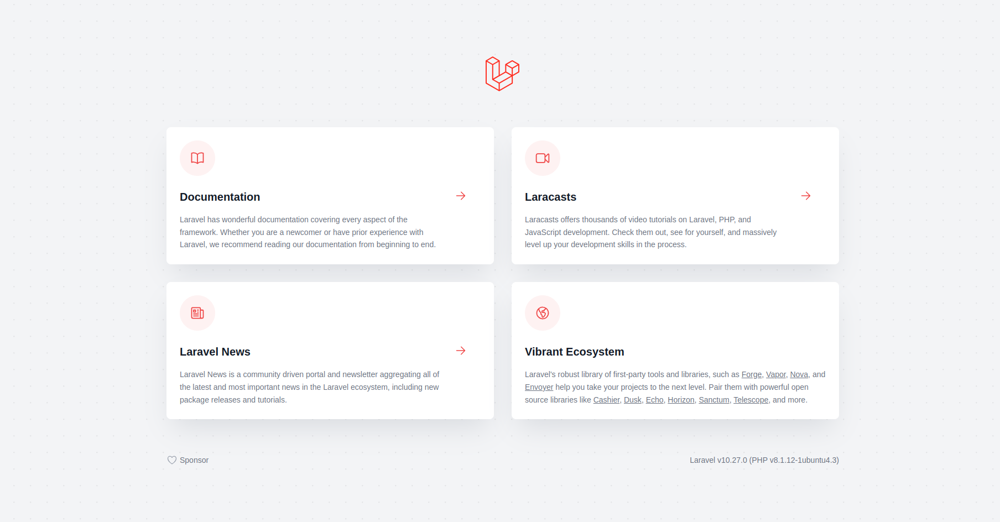
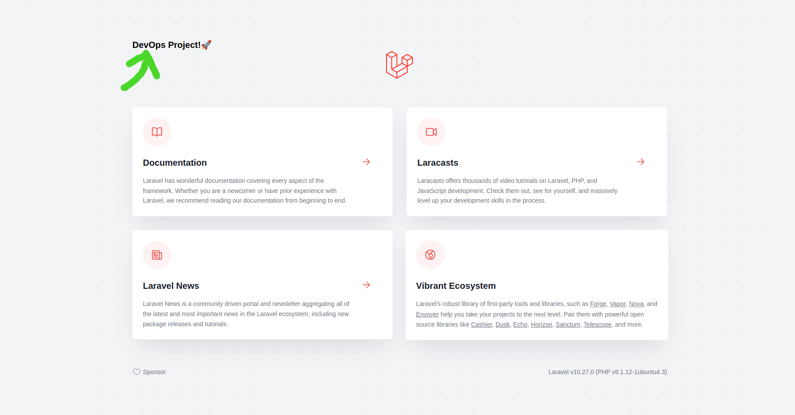

# DevOps Project!🚀

The above image reprerents the architecture diagram for the DevOps project. A more detailed review of this architecture can be found in the video submitted alongside this project. These are the links to access the applications live:

`Angular App` => https://frontend.ajim.dev

`Laravel App` => https://backend.ajim.dev

Also, each of the applications have their individual repositries that can all be accessed her:

`Angular Repo` => https://github.com/ajimbong/demo-frontend-devops

`Laravel Repo` => https://github.com/ajimbong/demo-backend-devops

### Before/After Results From Running the CI/CD Pipeline
Before:

After:

---

### Files
This repository contains all the scripts and config files that were used in this project. Let me explain below what each file does:

- `user-data.sh` is the user data script provided to my droplet upon creation to automatically bootstrap it with dependencies such nginx,nodejs and php that are needed to run the applications.

- `other-commands.sh` are miscellaneous commands I thougt I should save.

- `nginx-config.conf` contains the web server configuration used to serve the Angular and Laravel applications.

- `load-test.js` is the script I ran to generate load on my droplet to makesure the monitoring and alerting system works properly.

- `laravel-workflow.yml` is the github actions file to automatically build and deploy the Laravel application.

- `angular-workflow.yml` same as above, but for the Angular Application

